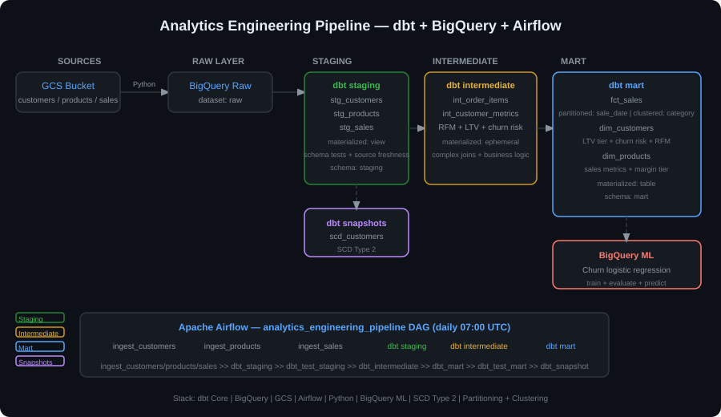

# Analytics Engineering with dbt + BigQuery + Airflow


End-to-end analytics engineering project that loads raw retail data from GCS into BigQuery and transforms it through a three-layer dbt pipeline (staging → intermediate → mart), producing production-ready data marts for customer analytics, product performance, and sales reporting — fully orchestrated by Apache Airflow.

## Architecture



## Data Flow

```
GCS (raw CSV)
   └── Python ingestion (full / incremental MERGE)
         └── BigQuery raw layer
               └── dbt staging     (views — clean + cast)
                     └── dbt intermediate  (ephemeral — joins + RFM)
                           └── dbt mart    (tables — fct_sales, dim_customers, dim_products)
                                 └── BigQuery ML  (churn prediction)
                                 └── dbt snapshots (SCD Type 2 — scd_customers)
```

## Project Structure

```
analytics-engineering-dbt-bigquery/
├── dbt_project/
│   ├── dbt_project.yml          # Project config (materialisations, schema)
│   ├── profiles.yml.example     # Dev + prod BigQuery connection
│   ├── models/
│   │   ├── staging/             # Thin views over raw BQ tables
│   │   │   ├── schema.yml       # Sources + column tests
│   │   │   ├── stg_customers.sql
│   │   │   ├── stg_products.sql
│   │   │   └── stg_sales.sql
│   │   ├── intermediate/        # Ephemeral join + logic layer
│   │   │   ├── int_order_items.sql
│   │   │   └── int_customer_metrics.sql
│   │   └── mart/                # Production tables (partitioned + clustered)
│   │       ├── fct_sales.sql
│   │       ├── dim_customers.sql
│   │       └── dim_products.sql
│   ├── snapshots/
│   │   └── scd_customers.sql    # SCD Type 2 customer history
│   ├── tests/
│   │   ├── assert_positive_revenue.sql
│   │   └── assert_no_orphan_sales.sql
│   └── macros/
│       └── generate_surrogate_key.sql
├── ingestion/
│   └── load_to_bigquery.py      # GCS → BQ raw (full + MERGE)
├── airflow/
│   └── dags/analytics_pipeline_dag.py
├── sql/
│   ├── window_functions_showcase.sql
│   ├── customer_cohort_analysis.sql
│   └── bigquery_ml_churn.sql
├── snapshots/
│   └── architecture.svg
├── .env.example
└── requirements.txt
```

## Key Features

**dbt Layer Design**
- `staging` — thin views that clean, cast, and rename raw columns; no business logic.
- `intermediate` — ephemeral models that join tables and compute RFM metrics, LTV tier, and churn risk.
- `mart` — production tables: `fct_sales` partitioned by `sale_date` and clustered by `category/country/channel`; `dim_customers` with full RFM profile; `dim_products` with sales performance.

**Data Quality**
- Column-level schema tests: `unique`, `not_null` on all primary keys.
- Custom singular tests: `assert_positive_revenue`, `assert_no_orphan_sales`.
- Source freshness checks in `schema.yml`.

**SCD Type 2 Snapshots**
- `scd_customers` tracks changes to `email`, `country`, `city`, `is_active` over time using dbt's `check` strategy.

**Ingestion**
- `load_to_bigquery.py` supports full WRITE_TRUNCATE loads and incremental MERGE upserts using BigQuery DML.

**Advanced SQL**
- Window functions: running totals, 30-day moving averages, LAG/LEAD, RANK, cohort retention.
- BigQuery ML: logistic regression churn model trained, evaluated, and scored entirely in SQL.

## dbt Models

| Model | Layer | Materialisation | Description |
|---|---|---|---|
| `stg_customers` | Staging | View | Normalised customer records |
| `stg_products` | Staging | View | Products with margin_pct + tier |
| `stg_sales` | Staging | View | Sales with net_revenue |
| `int_order_items` | Intermediate | Ephemeral | Joined order items grain |
| `int_customer_metrics` | Intermediate | Ephemeral | RFM + LTV + churn risk |
| `fct_sales` | Mart | Table | Fact table, partitioned + clustered |
| `dim_customers` | Mart | Table | Customer dim with LTV tier |
| `dim_products` | Mart | Table | Product dim with sales metrics |
| `scd_customers` | Snapshot | Snapshot | SCD Type 2 customer history |

## Quick Start

```bash
# 1. Clone + install
git clone https://github.com/jaiminbabariya7/analytics-engineering-dbt-bigquery.git
cd analytics-engineering-dbt-bigquery
pip install -r requirements.txt

# 2. Configure environment
cp .env.example .env
# Fill in GCP_PROJECT_ID, GOOGLE_APPLICATION_CREDENTIALS, GCS_RAW_BUCKET

# 3. Configure dbt profile
cp dbt_project/profiles.yml.example ~/.dbt/profiles.yml

# 4. Load raw data
python ingestion/load_to_bigquery.py --table customers --mode full
python ingestion/load_to_bigquery.py --table products  --mode full
python ingestion/load_to_bigquery.py --table sales     --mode full

# 5. Run dbt
cd dbt_project
dbt deps
dbt run
dbt test
dbt snapshot

# 6. Start Airflow (daily scheduling)
airflow db init
airflow dags unpause analytics_engineering_pipeline
```

## Environment Variables

| Variable | Description |
|---|---|
| `GCP_PROJECT_ID` | Google Cloud project ID |
| `GOOGLE_APPLICATION_CREDENTIALS` | Path to service account JSON |
| `GCS_RAW_BUCKET` | GCS bucket holding raw CSVs |
| `BQ_RAW_DATASET` | BigQuery dataset for raw tables (default: `raw`) |
| `BQ_DBT_DATASET` | BigQuery dataset for dbt output (default: `dbt_prod`) |

## Tech Stack

| Layer | Technology |
|---|---|
| Transformation | dbt Core 1.7 |
| Data Warehouse | Google BigQuery |
| Object Storage | Google Cloud Storage |
| Orchestration | Apache Airflow 2.8 |
| ML | BigQuery ML (Logistic Regression) |
| Language | Python 3.11 |
| Data Modelling | Kimball (fact + dimensions) + SCD Type 2 |